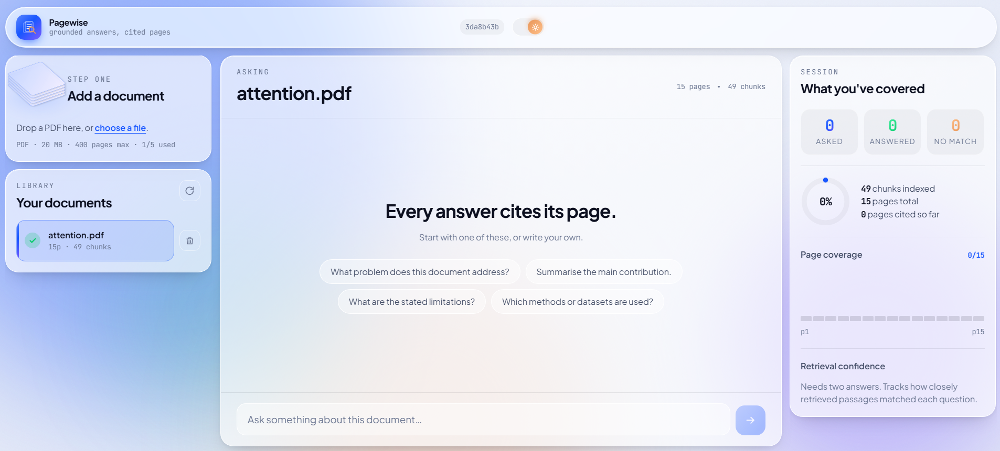
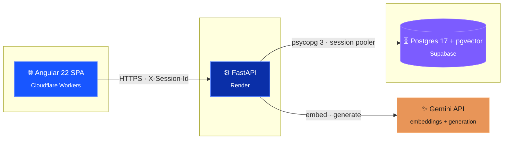
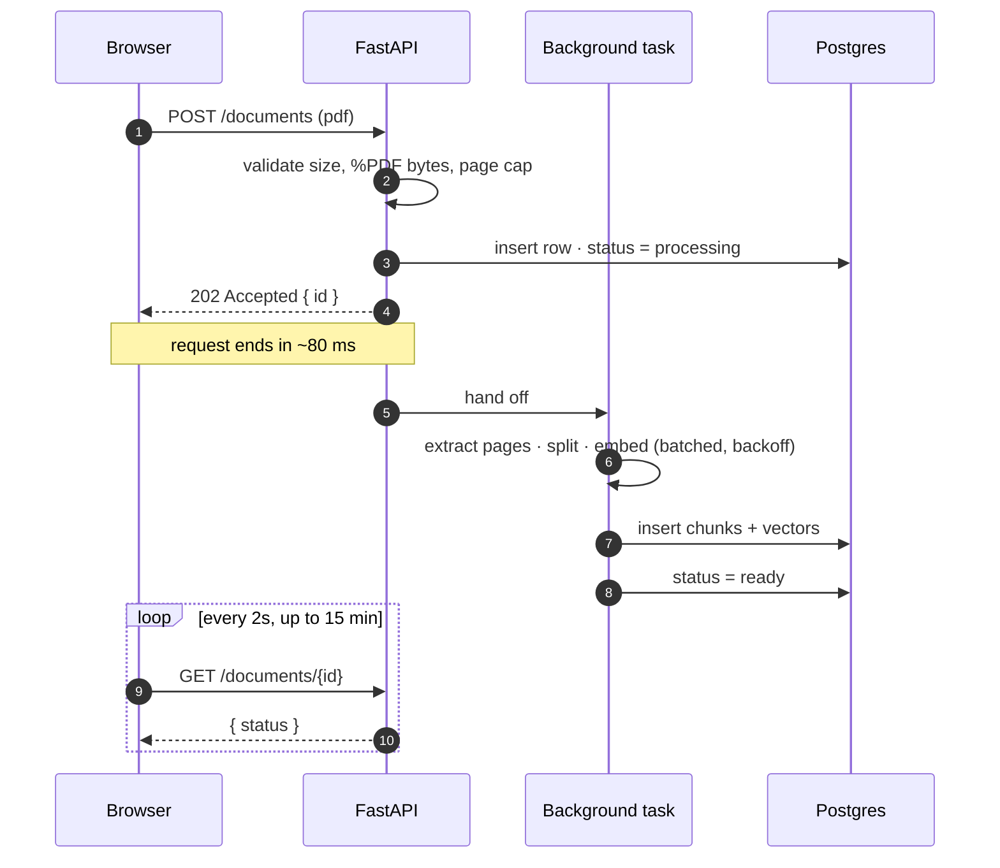
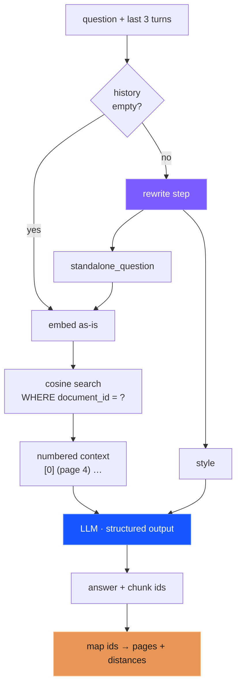

<div align="center">


# Pagewise

**Ask a document anything. Every answer cites the page it came from.**

A retrieval-augmented generation app built end to end — ingestion pipeline,
vector search, REST API, and a single-page frontend. No answer is produced
without a source, and when the document doesn't contain one, it says so.

[**Live demo →**](https://document-info-retriever.souravkr-62.workers.dev)&nbsp;&nbsp;·&nbsp;&nbsp;
[API docs](https://document-info-retriever.onrender.com/docs)&nbsp;&nbsp;·&nbsp;&nbsp;
[Architecture](docs/ARCHITECTURE.md)&nbsp;&nbsp;·&nbsp;&nbsp;
[Deployment](docs/DEPLOYMENT.md)

<br/>


</div>

> [!NOTE]
> The backend runs on Render's free tier and **sleeps after 15 minutes idle**.
> The first request takes about 50 seconds to wake it. The UI says so rather
> than showing an error — but give it a moment.

<br/>

<!-- Replace with a real screenshot or GIF. The citation fan animating is the
     shot worth capturing. -->
<div align="center">
  
</div>

---

## The problem

Ask a chatbot about a document and you get fluent, confident prose with no way
to check it. The failure mode isn't being wrong — it's being wrong
*persuasively*, with nothing to verify against.

Pagewise inverts that. The model only sees passages retrieved from your
document, every claim carries the chunk it came from, and the server maps those
back to real page numbers. If retrieval finds nothing relevant, the answer is
"this document doesn't cover that" — which is a feature, not a failure.

```
 You ask ─────▶ question is embedded ─────▶ 5 nearest chunks from YOUR pdf
                                                       │
                                                       ▼
 cited answer ◀───── page numbers ◀───── model answers from those chunks only
```

---

## What's inside

|  | |
|---|---|
| **Grounded answers** | The prompt contains only retrieved chunks. The model cites chunk numbers; the server resolves them to pages. Cited indices are bounds-checked — an LLM's output is never trusted as a list subscript. |
| **Honest refusals** | A dedicated `enough_info` field in the output schema. When the context can't answer, that's what comes back — no invented filler. |
| **Follow-ups that work** | "Why does it help?" and "say that more simply" are rewritten into standalone questions before retrieval. A pure style request still searches the original topic. |
| **Async ingestion** | Upload returns `202` in ~80ms. Parsing, chunking and embedding run in a background task; the client polls a status column. |
| **Retrieval telemetry** | Cosine distance surfaces in the UI as per-source relevance dials, a page-coverage map, and a confidence trend. You can see *why* an answer came out the way it did. |
| **Real edge cases** | Scanned PDFs, password-protected files, page caps, rate-limit backoff, session isolation, cold starts — each fails with a message you can act on. |

---

## Architecture



The browser never talks to Postgres or Gemini. The database credentials and the
API key exist only in the backend's environment.

### Ingestion is asynchronous



The `status` column is the only bridge between the two timelines. The worker
writes it; the browser polls it.

<details>
<summary><b>Why the background task must never raise</b></summary>

<br/>

It runs in a thread with nobody waiting to catch it. An uncaught exception
would vanish into the logs and leave the document stuck on `processing`
forever, with the frontend polling until timeout.

Every failure path writes `status='failed'` with a readable message, because
that message is what the UI shows the user.

</details>

### Query



---

## Engineering decisions worth explaining

<details>
<summary><b>Two embedding models, not one</b> — the highest-impact line in the retrieval path</summary>

<br/>

Gemini's embedding model is **asymmetric**. It was trained so a question's
vector lands near the passage that *answers* it, not near a similarly-worded
question.

```python
document_embeddings = GoogleGenerativeAIEmbeddings(task_type="retrieval_document")
query_embeddings    = GoogleGenerativeAIEmbeddings(task_type="retrieval_query")
```

The index is **built** with the first and **searched** with the second. Use one
for both and search still returns results — nearest neighbours always exist —
just consistently the wrong ones. Silent, and free to fix.

</details>

<details>
<summary><b>The rewrite step</b> — why "explain that more simply" used to fail</summary>

<br/>

Retrieval embeds your message and finds similar passages. That's correct for
*"what is multi-head attention?"* and completely wrong for *"answer in simpler
words with an example"* — the second is an instruction about **format**, not a
question about **content**. Embedded literally it matches nothing, the model
sees five random chunks, and correctly reports it can't answer.

The fix splits a message in two:

| You type | `standalone_question` | `style` |
|---|---|---|
| "answer in simpler words with an example" | *(previous question, unchanged)* | "brief, simple words, include an example" |
| "why does it help?" | "Why does multi-head attention help?" | `null` |
| "what are the limitations?" | *(unchanged)* | `null` |

Retrieval runs on the question; the style is injected into the answer prompt.
One mechanism handles pronoun resolution and formatting requests. It's skipped
on the first message, and any failure falls back to the raw question.

When the question changes, `resolved_question` comes back and the UI shows a
"Searched for…" line — otherwise a resolved follow-up looks like the model
answered something you never asked.

</details>

<details>
<summary><b>Citations the model can't fake</b></summary>

<br/>

The model never sees a page number it has to remember:

```
context:  [0] (page 4) …   [1] (page 5) …   [2] (page 2) …
model:    { "sources": [0, 1] }
server:   results[0]["page"] → 4    results[1]["page"] → 5
```

The server does the lookup. The model only counts. Indices are bounds-checked
before use, because even with constrained decoding a model can emit `[7]` when
five chunks were provided.

</details>

<details>
<summary><b>Nothing touches disk</b></summary>

<br/>

`PdfReader(io.BytesIO(data))` reads uploads from memory. Render's filesystem is
ephemeral — anything written there disappears on restart or redeploy. Writing
uploads to disk works perfectly in local development and silently breaks in
production, which is the worst combination.

</details>

<details>
<summary><b>The page cap matters more than the byte cap</b></summary>

<br/>

File size is a poor proxy for work: a 2 MB text PDF can hold 800 pages, a 40 MB
scanned one can hold 12. Pages drive chunk count, which drives embedding calls,
memory and wall-clock time.

So there's a 400-page cap alongside the 20 MB limit, and it's the one that
actually protects the free-tier container.

</details>

<details>
<summary><b>Postgres instead of a vector database</b></summary>

<br/>

pgvector with an HNSW index holds documents, chunks, embeddings and sessions in
one system. A dedicated vector DB would mean two datastores to keep consistent
for a corpus this size.

The operator class must match the query operator — build with
`vector_cosine_ops`, query with `<=>`. Mismatch them and Postgres silently
ignores the index and does a full scan. No error, just slow.

</details>

<details>
<summary><b>Signals everywhere, because Angular 22 is zoneless</b></summary>

<br/>

v22 runs zoneless with OnPush by default. A plain class field assigned inside
an HTTP callback updates the object and **never re-renders** — silently, no
error.

All state lives in `DocumentStore` as signals, and the charts are `computed()`
over those signals. There is no chart-refresh code anywhere; they update because
their inputs did.

</details>

<details>
<summary><b>No chart library</b></summary>

<br/>

Four small visuals over data this shaped would cost ~200KB and fight the design
token system the whole way. Inline SVG inherits the CSS variables, so light and
dark themes work with no extra code.

</details>

---

## Stack

| Layer | Choice | Why this one |
|---|---|---|
| Frontend | **Angular 22** — zoneless, signals, standalone | Signals make zoneless change detection predictable |
| Styling | **SCSS + CSS custom properties** | Two themes from one token set, zero runtime cost |
| Charts | **Hand-rolled SVG** | Inherits theme variables; no bundle cost |
| Backend | **FastAPI + Uvicorn** (Python 3.12) | Async, Pydantic validation, free OpenAPI docs |
| PDF | **pypdf** | Reads from bytes; no disk required |
| Chunking | **LangChain** recursive splitter | Breaks on paragraph → sentence → word |
| Embeddings | **Gemini `gemini-embedding-001`**, 768-dim | API-based, so no 2 GB PyTorch install — this is what makes free hosting viable |
| Vectors | **Postgres 17 + pgvector**, HNSW | One database for everything |
| LLM | **Gemini `gemini-3.5-flash`**, temp 0 | Native structured output, fast, cheap |
| Driver | **psycopg 3** | Explicit `::vector` casts, no adapter dependency |

---

## Quickstart

```bash
git clone https://github.com/Sourav-Kumar-bit/Document-Info-Retriever.git
cd Document-Info-Retriever
```

<details>
<summary><b>1 · Database</b></summary>

<br/>

Create a Supabase project, then run this in the SQL editor:

```sql
create extension if not exists vector;

create table documents (
  id          uuid primary key default gen_random_uuid(),
  session_id  text not null,
  filename    text not null,
  status      text not null default 'processing',
  error       text,
  page_count  int,
  chunk_count int,
  created_at  timestamptz default now()
);

create table chunks (
  id          bigserial primary key,
  document_id uuid not null references documents(id) on delete cascade,
  chunk_index int not null,
  page        int,
  content     text not null,
  embedding   vector(768)
);

create index on chunks using hnsw (embedding vector_cosine_ops);
create index on chunks (document_id);
create index on documents (session_id);
```

Choose **Run without RLS** — nothing reaches this database except the backend,
over a direct connection as the `postgres` role. See
[ARCHITECTURE.md](docs/ARCHITECTURE.md) for when that must be revisited.

</details>

<details>
<summary><b>2 · Backend</b></summary>

<br/>

```bash
cd server
python -m venv venv
venv\Scripts\Activate.ps1          # Unix: source venv/bin/activate
python -m pip install -r requirements.txt
cp .env.example .env
uvicorn main:app --reload
```

`.env`:

```ini
GEMINI_API_KEY=your_key

# Use the SESSION POOLER host — the direct db.<ref>.supabase.co host is
# IPv6-only on the free tier and unreachable from most cloud providers.
DB_HOST=aws-0-<region>.pooler.supabase.com
DB_PORT=5432
DB_NAME=postgres
DB_USER=postgres.<project-ref>
DB_PASSWORD=your_password

ALLOWED_ORIGINS=http://localhost:4200
MAX_UPLOAD_MB=20
MAX_PAGES=400
```

→ http://localhost:8000/docs (every endpoint needs an `X-Session-Id` header;
any string works)

</details>

<details>
<summary><b>3 · Frontend</b></summary>

<br/>

```bash
cd client
npm install
ng serve
```

→ http://localhost:4200

`environment.development.ts` points at the **deployed** backend on purpose, so
CORS, cold starts and real latency show up while they're cheap to fix. Change
`apiUrl` to `http://localhost:8000` when debugging the backend itself.

</details>

---

## Layout

```
Document-Info-Retriever/
├── client/                     Angular 22
│   ├── public/                 favicons, manifest → served from site root
│   ├── wrangler.jsonc          Cloudflare Workers config
│   └── src/app/
│       ├── core/               models · api · store · session · theme
│       ├── shared/             tilt directive
│       └── features/           uploader · library · chat · insights
│
├── server/                     FastAPI
│   ├── main.py                 routes · CORS · background dispatch
│   ├── rag.py                  ingestion · rewrite · answering
│   ├── db.py                   every SQL statement
│   ├── schemas.py              HTTP contract
│   └── config.py               settings · model clients
│
└── docs/
```

> **One structural rule:** imports flow `main.py → rag.py → db.py → config.py`
> and never backwards. `db.py` must not import FastAPI; `rag.py` must not raise
> `HTTPException`. That boundary is what lets the whole pipeline be tested from
> a scratch script with no server running.

---

## Limits

| | Value | Env var |
|---|---|---|
| Upload size | 20 MB | `MAX_UPLOAD_MB` |
| Pages per PDF | 400 | `MAX_PAGES` |
| Documents per session | 5 | `MAX_DOCS_PER_SESSION` |
| Chunks retrieved | 5 | — |
| History turns sent | 3 | `HISTORY_TURNS` |
| Embedding batch | 50 | `EMBED_BATCH` |

The frontend reads the first three from `GET /limits` instead of hardcoding
them, so raising a limit server-side needs no frontend redeploy.

---

## Deployed on

| Component | Host | Free-tier catch |
|---|---|---|
| Frontend | Cloudflare Workers | none |
| Backend | Render | sleeps after 15 min idle, ~50 s cold start |
| Database | Supabase | **pauses after 7 days idle** |
| AI | Google Gemini | aggressive rate limits |

Full configuration, every environment variable, and redeploy procedures:
[**docs/DEPLOYMENT.md**](docs/DEPLOYMENT.md)

---

## Known limitations

- **Scanned PDFs are rejected.** Ingestion checks extracted character count and
  fails with a clear message. No OCR.
- **No authentication.** Sessions are a `localStorage` UUID. Fine for a demo,
  not for real data.
- **Chat history is in memory**, scoped per document. Refreshing clears it.
- **The original PDF is discarded** after ingestion — only chunks are stored, so
  there's no in-app viewer yet.
- **Dense retrieval only.** No BM25, no hybrid search, no reranking.
- **No evaluation harness.** Retrieval quality isn't measured.

---

## Roadmap

- [ ] **PDF viewer with citation highlighting** — click a page card, watch the
      PDF scroll and highlight the passage. Needs bounding boxes, so ingestion
      moves to PyMuPDF.
- [ ] **Hybrid retrieval** — `tsvector` column, BM25 blended with vectors via
      reciprocal rank fusion. Matters most for exact terms like "BLEU".
- [ ] **Cross-encoder reranking** — retrieve 20, rerank to 5.
- [ ] **Streaming answers** — conflicts with structured output; stream prose
      with inline `[0]` markers and resolve client-side.
- [ ] **Supabase Auth**, replacing the localStorage session.
- [ ] **Evaluation harness** — 20 labelled questions, recall@5 in the README.

---

## Documentation

| | |
|---|---|
| [**Architecture**](docs/ARCHITECTURE.md) | Data flow, request lifecycles, schema, frontend state |
| [**Deployment**](docs/DEPLOYMENT.md) | Hosts, every env var, redeploy checklist |
| [**API reference**](docs/API.md) | Endpoints, payloads, status-code conventions |
| [**Troubleshooting**](docs/TROUBLESHOOTING.md) | Every failure hit while building this, and its fix |

<div align="center">
<br/>
<sub>Built by <a href="https://github.com/Sourav-Kumar-bit">Sourav Kumar</a></sub>
</div>
